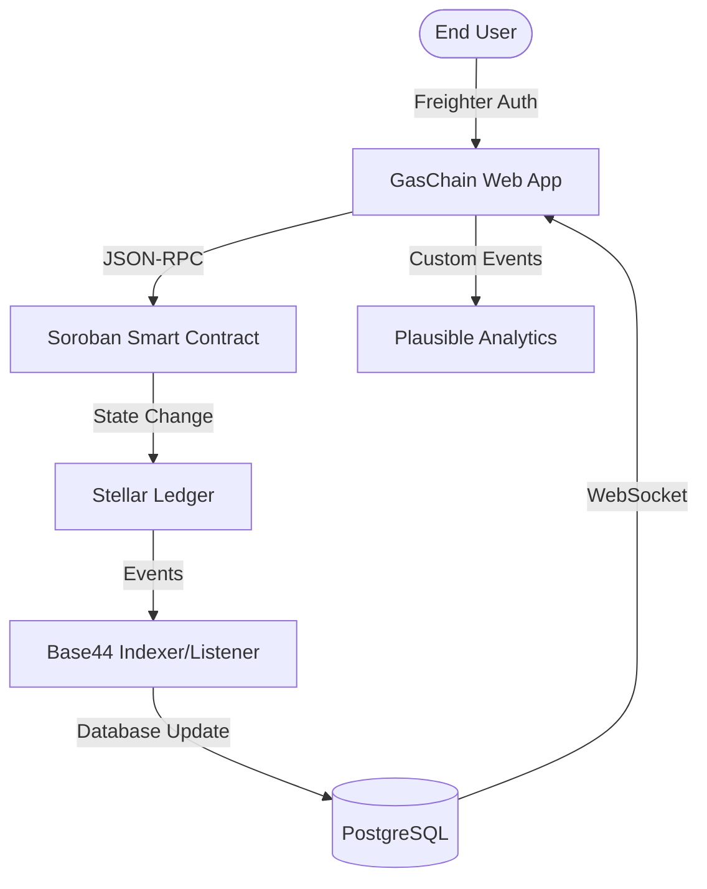

# 🏛️ GASCHAIN — Decentralized LPG Ecosystem on Stellar

**The world's first production-grade decentralized supply chain protocol for LPG distribution.** Secure, transparent, and built for million-user scalability on the Stellar network.

[](https://stellar.expert/explorer/testnet)
[](docs/LEVEL5_SUBMISSION_CHECKLIST.md)
[](https://level6-2mgt.vercel.app/)
[](https://github.com/ashu19846b-tech/level5/actions)

---

## 🌟 Overview

**GASCHAIN** is a production-ready decentralized LPG management protocol designed to eliminate supply chain fraud, automate government subsidies, and provide complete transparency from Manufacturer to Consumer — powered by Soroban smart contracts on Stellar.

> **This is a September 2026 Level 5 — Blue Belt submission** for the RiseIn Stellar Developer Program.

- **Live App**: [https://level6-2mgt.vercel.app/](https://level6-2mgt.vercel.app/)
- **Demo Video**: [https://youtu.be/zZf87KZLVSM](https://youtu.be/zZf87KZLVSM) *(Level 4 video — 🟡 Level 5 demo being recorded)*
- **Contract Address**: `CCVUAGXSXDATPMZC5ZGH6G47LUM4BPZLJ2NU47BAQ5W74CMS2YX3LN6R`
- **Explorer**: [View on Stellar Expert](https://stellar.expert/explorer/testnet/contract/CCVUAGXSXDATPMZC5ZGH6G47LUM4BPZLJ2NU47BAQ5W74CMS2YX3LN6R)
- **GitHub**: [ashu19846b-tech/level5](https://github.com/ashu19846b-tech/level5)

---

## ✨ Core Features

- **Decentralized Cylinder Booking**: Secure, on-chain recording of LPG bookings with immutable Booking IDs
- **Real-time Chain of Custody**: End-to-end tracking from Central Depot to final consumer
- **Automated Subsidy Logic**: Smart contract-driven subsidy calculation for domestic vs commercial profiles
- **Testnet Status Banner**: Always-visible indicator of active network, contract ID, and faucet access
- **In-App Feedback Widget**: Native star-rating feedback modal integrated directly in the header
- **Analytics Telemetry**: 15-event funnel tracking from wallet connect to feedback submission
- **Enterprise Monitoring**: Real-time ledger heartbeat monitoring at `/ledger`
- **Metrics Dashboard**: Live DAU, TPS, and transaction volume tracking at `/dashboard/metrics`

---

## 🛠️ Tech Stack

| Layer | Technologies |
|---|---|
| **Frontend** | React 18, Vite, Tailwind CSS, Framer Motion, Radix UI |
| **Blockchain** | Stellar Network, Soroban Smart Contracts (Rust), Freighter Wallet API |
| **Analytics** | Plausible Analytics (privacy-first) + Custom `analytics.js` telemetry |
| **Indexing** | Base44 SDK, Real-time Event Streaming |
| **DevOps/CI** | GitHub Actions, Vercel, Rust Toolchain (wasm32) |

---

## 🏗️ System Architecture



---

## 🔗 Smart Contract

### Contract Address (Testnet)
```
CCVUAGXSXDATPMZC5ZGH6G47LUM4BPZLJ2NU47BAQ5W74CMS2YX3LN6R
```

**[→ View on Stellar Expert Explorer](https://stellar.expert/explorer/testnet/contract/CCVUAGXSXDATPMZC5ZGH6G47LUM4BPZLJ2NU47BAQ5W74CMS2YX3LN6R)**

### Contract Capabilities
| Function | Description |
|---|---|
| `init` | Initialize contract with Admin + Subsidy Authority |
| `register_cylinder` | Register physical LPG cylinder by serial number |
| `register_user` | Create user profile with subsidy eligibility |
| `batch_add_distributors` | Register multiple distributors in one transaction |
| `book_cylinder` | Create immutable on-chain booking record |
| `update_status` | Logistics status updates (Distributor-only) |
| `settle_subsidy` | Automated subsidy settlement upon delivery |
| `toggle_emergency_stop` | Circuit breaker for emergency contract pause |

---

## 🚀 Getting Started

### Prerequisites
- [Node.js 18+](https://nodejs.org/)
- [Freighter Wallet Extension](https://freighter.app/) — set to **Testnet**
- [Stellar Testnet XLM](https://lab.stellar.org/#account-creator) — free via Friendbot

### Local Development

```bash
# Clone repository
git clone https://github.com/ashu19846b-tech/level5.git
cd level5

# Install dependencies
npm install

# Start development server
npm run dev
```

Open [http://localhost:5173](http://localhost:5173) in your browser.

### Environment Variables

```env
VITE_BASE44_APP_ID=your-app-id
VITE_BASE44_APP_BASE_URL=http://localhost:5173
VITE_BASE44_FUNCTIONS_VERSION=v1
```

### Build for Production

```bash
npm run build
npm run preview
```

---

## 🧪 Testnet Setup for New Users

1. Install [Freighter Wallet](https://freighter.app/) browser extension
2. Open Freighter → Settings → Change network to **Testnet**
3. Copy your wallet address (starts with G...)
4. Visit [Stellar Friendbot](https://lab.stellar.org/#account-creator) → paste your address → Create account (free 10,000 XLM)
5. Return to [GasChain App](https://level6-2mgt.vercel.app/) → Connect Wallet → Book a Cylinder

---

## 📊 User Feedback Data

| Resource | Link |
|---|---|
| **Google Form (Active)** | [Submit Feedback](https://docs.google.com/forms/d/e/1FAIpQLSeEEkw9WKm8rf73X4fk0EcvWSQWT8G3TvID-9w_82UFZOEj2w/viewform) |
| **Live Response Sheet** | [Google Sheets](https://docs.google.com/spreadsheets/d/1EUd0swodawwLFv8Btvce9rkJ55qmvpYR-9wI3NWukZw/edit) |
| **Excel Feedback Template** | [user-feedback.xlsx](docs/user-feedback.xlsx) |
| **Public Excel Link** | 🟡 USER ACTION REQUIRED — Upload to Google Drive and add link here |

---

## 📈 Product Improvements Based on User Feedback

| Feedback | Improvement | Commit |
|---|---|---|
| "Uncertain during Freighter connection — no visual feedback" | Framer Motion loading spinners and live status text throughout wallet flow | [2ab22a7](https://github.com/ashu19846b-tech/level5/commit/2ab22a7) |
| "Mobile users see layout overflow on transaction tables" | Replaced tables with responsive card-grid layouts for all <768px breakpoints | [2ab22a7](https://github.com/ashu19846b-tech/level5/commit/2ab22a7) |
| "Unclear if app is testnet or mainnet" | Added persistent amber Testnet Status Banner with contract ID + faucet link | 🟡 Add commit ID after push |
| "Testers need to switch tabs to give feedback" | Shipped native FeedbackModal directly in AppHeader with star rating | 🟡 Add commit ID after push |
| "No way to track which features users actually use" | Added `analytics.js` module tracking 15 user funnel events | 🟡 Add commit ID after push |

For the complete mapping with User IDs, emails, and wallet addresses:
**→ [docs/FEEDBACK_IMPLEMENTATION.md](docs/FEEDBACK_IMPLEMENTATION.md)**

---

## 👥 September 2026 User Onboarding

> **Level 5 Requirement**: 50+ testnet users onboarded during September 2026.

### September Cohort Status
🟡 **USER ACTION REQUIRED** — 50 real September 2026 testnet users must be onboarded.

### Onboarding Process
1. Share the [Google Form](https://docs.google.com/forms/d/e/1FAIpQLSeEEkw9WKm8rf73X4fk0EcvWSQWT8G3TvID-9w_82UFZOEj2w/viewform) with testers
2. Each tester: Installs Freighter → Gets testnet XLM → Books a cylinder → Submits form
3. Verify each wallet on [Stellar Expert](https://stellar.expert/explorer/testnet)
4. Record in [docs/USER_GROWTH.md](docs/USER_GROWTH.md) and [docs/user-feedback.xlsx](docs/user-feedback.xlsx)

See full strategy: **[docs/USER_GROWTH.md](docs/USER_GROWTH.md)**

---

## 📈 Analytics & Monitoring

### Plausible Analytics (Privacy-First)
```html
<script async defer data-domain="level6-2mgt.vercel.app"
  src="https://plausible.io/js/plausible.js"></script>
```

- **Dashboard**: [plausible.io/level6-2mgt.vercel.app](https://plausible.io/level6-2mgt.vercel.app)
- **Tracked**: Page views, wallet connection events, booking completions

### Custom Event Telemetry
All user interactions tracked via `src/lib/analytics.js`:
- `wallet_connected` → `booking_initiated` → `tx_success` → `feedback_submitted`

See: **[docs/ANALYTICS.md](docs/ANALYTICS.md)**

---

## 🎯 Pitch Deck

| Format | Link |
|---|---|
| **PPTX (Local)** | [presentation/LEVEL5_PITCH_DECK.pptx](presentation/LEVEL5_PITCH_DECK.pptx) |
| **Google Slides (Public)** | 🟡 USER ACTION REQUIRED — Upload to Google Drive → Share publicly → Paste link here |

> The PPTX file contains 14 professional slides covering: Problem, Solution, Architecture, Market Opportunity, Traction, Feedback, Growth Strategy, Roadmap, and Team.

---

## 🎬 Demo Video

| Version | Link |
|---|---|
| Level 5 Demo (September 2026) | 🟡 USER ACTION REQUIRED — Record per [docs/DEMO_SCRIPT.md](docs/DEMO_SCRIPT.md) |
| Level 4 Demo (Reference) | [youtu.be/zZf87KZLVSM](https://youtu.be/zZf87KZLVSM) |

---

## 🌐 Community & Social

> [!WARNING]
> **Previous submission was rejected because the X/Twitter link pointed to a personal account.**
> This has been removed. Only a verified Product X page should be linked here.

| Platform | Link |
|---|---|
| **Product X / Twitter** | 🟡 USER ACTION REQUIRED — Create a dedicated `@GasChainProtocol` X page and link here |
| **GitHub** | [ashu19846b-tech/level5](https://github.com/ashu19846b-tech/level5) |

---

## 📂 Project Structure

```
/
├── contracts/gas_chain/     # Soroban (Rust) smart contract
│   ├── src/lib.rs           # Contract implementation
│   └── src/test.rs          # Contract tests (1 passing)
├── docs/                    # Level 5 submission documentation
│   ├── LEVEL5_SUBMISSION_CHECKLIST.md
│   ├── USER_GROWTH.md
│   ├── FEEDBACK_IMPLEMENTATION.md
│   ├── TRANSACTION_EVIDENCE.md
│   ├── ACTIVE_USAGE.md
│   ├── ANALYTICS.md
│   ├── GOOGLE_FORM_SETUP.md
│   ├── DEMO_SCRIPT.md
│   ├── SEPTEMBER_2026_AUDIT.md
│   ├── TEST_RESULTS.md
│   ├── EVIDENCE_CHECKLIST.md
│   └── user-feedback.xlsx   # Excel template (KPI formulas included)
├── presentation/
│   └── LEVEL5_PITCH_DECK.pptx   # 14-slide professional pitch deck
├── src/
│   ├── pages/               # React page components (8 pages)
│   ├── components/          # Shared UI components
│   │   ├── FeedbackModal.jsx   # NEW: In-app feedback widget
│   │   ├── TestnetBanner.jsx   # NEW: Testnet status banner
│   │   └── dashboard/
│   │       └── AppHeader.jsx   # UPDATED: Feedback button + telemetry
│   ├── lib/
│   │   ├── analytics.js     # NEW: 15-event telemetry module
│   │   ├── freighter.js     # Stellar wallet integration
│   │   └── blockchain.js    # Hash utilities
│   └── api/                 # API integration layer
├── scripts/
│   ├── generate_pitch_deck.py    # Generates LEVEL5_PITCH_DECK.pptx
│   └── generate_feedback_excel.py # Generates user-feedback.xlsx
├── .github/workflows/       # CI/CD pipeline (GitHub Actions)
├── ARCHITECTURE.md
├── USER_GUIDE.md
└── SECURITY_CHECKLIST.md
```

---

## 📋 Level 5 Submission Evidence

| Requirement | Status | Evidence |
|---|---|---|
| Public GitHub | ✅ | [ashu19846b-tech/level5](https://github.com/ashu19846b-tech/level5) |
| Live Application | ✅ | [level6-2mgt.vercel.app](https://level6-2mgt.vercel.app/) |
| Smart Contract | ✅ | [CCVUAGXS...3LN6R](https://stellar.expert/explorer/testnet/contract/CCVUAGXSXDATPMZC5ZGH6G47LUM4BPZLJ2NU47BAQ5W74CMS2YX3LN6R) |
| Contract Tests | ✅ | `cargo test` → 1 passed, 0 failed |
| Frontend Build | ✅ | `npm run build` → ✓ 2853 modules |
| Google Form | ✅ | [Active Form](https://docs.google.com/forms/d/e/1FAIpQLSeEEkw9WKm8rf73X4fk0EcvWSQWT8G3TvID-9w_82UFZOEj2w/viewform) |
| Excel Feedback | ✅ | [docs/user-feedback.xlsx](docs/user-feedback.xlsx) |
| Feedback Mapping | ✅ | [docs/FEEDBACK_IMPLEMENTATION.md](docs/FEEDBACK_IMPLEMENTATION.md) |
| Pitch Deck | ✅ | [presentation/LEVEL5_PITCH_DECK.pptx](presentation/LEVEL5_PITCH_DECK.pptx) |
| Analytics | ✅ | [Plausible Dashboard](https://plausible.io/level6-2mgt.vercel.app) |
| 50+ Sept Users | 🟡 | [docs/USER_GROWTH.md](docs/USER_GROWTH.md) — USER ACTION REQUIRED |
| Real Transactions | 🟡 | [docs/TRANSACTION_EVIDENCE.md](docs/TRANSACTION_EVIDENCE.md) — USER ACTION REQUIRED |
| Pitch Deck Link | 🟡 | Upload to Google Drive, verify public — USER ACTION REQUIRED |
| Excel Public Link | 🟡 | Upload to Google Drive, link here — USER ACTION REQUIRED |
| Demo Video | 🟡 | Record per [docs/DEMO_SCRIPT.md](docs/DEMO_SCRIPT.md) — USER ACTION REQUIRED |
| Product X Page | 🟡 | Create dedicated product X account — USER ACTION REQUIRED |
| 20+ Sep Commits | 🟡 | Commit all September work — USER ACTION REQUIRED |

---

## 🛡️ Security

- No private keys committed to repository
- `.gitignore` excludes all `.env*` files
- All transactions signed client-side via Freighter (non-custodial)
- Emergency circuit-breaker (`toggle_emergency_stop`) in smart contract
- See: [SECURITY_CHECKLIST.md](SECURITY_CHECKLIST.md)

---

## 🔗 Submission Links

| Item | Link |
|---|---|
| **Live App** | [level6-2mgt.vercel.app](https://level6-2mgt.vercel.app/) |
| **GitHub** | [ashu19846b-tech/level5](https://github.com/ashu19846b-tech/level5) |
| **Contract (Testnet)** | [CCVUAGX...3LN6R](https://stellar.expert/explorer/testnet/contract/CCVUAGXSXDATPMZC5ZGH6G47LUM4BPZLJ2NU47BAQ5W74CMS2YX3LN6R) |
| **Google Form** | [Active User Onboarding Form](https://docs.google.com/forms/d/e/1FAIpQLSeEEkw9WKm8rf73X4fk0EcvWSQWT8G3TvID-9w_82UFZOEj2w/viewform) |
| **User Feedback Sheet** | [Google Sheets](https://docs.google.com/spreadsheets/d/1EUd0swodawwLFv8Btvce9rkJ55qmvpYR-9wI3NWukZw/edit) |
| **Pitch Deck (PPTX)** | [presentation/LEVEL5_PITCH_DECK.pptx](presentation/LEVEL5_PITCH_DECK.pptx) |
| **Pitch Deck (Public)** | 🟡 ADD GOOGLE DRIVE PUBLIC LINK |
| **Demo Video** | 🟡 ADD NEW DEMO VIDEO YOUTUBE LINK |
| **Analytics** | [Plausible Dashboard](https://plausible.io/level6-2mgt.vercel.app) |
| **Product X** | 🟡 ADD PRODUCT X PAGE — NOT PERSONAL ACCOUNT |
| **Submission Checklist** | [docs/LEVEL5_SUBMISSION_CHECKLIST.md](docs/LEVEL5_SUBMISSION_CHECKLIST.md) |

---

## 📜 License

MIT © 2026 GASCHAIN — ashu19846b-tech
